# CveNet

A multi-agent CVE security analysis system built with **ASP.NET Core Minimal APIs** on **Azure Kubernetes Service**. Ask a natural-language question about vulnerabilities — CveNet parses your intent, retrieves matching CVEs from a vector search index, scores them by risk, and synthesizes an executive-ready report.

> Built on Azure free-tier services where possible — great for learning, prototyping, or running at low volume.

---

## Architecture

A walkthrough of the multi-agent pipeline — orchestrator fan-out, parallel agent calls, and convergence into the final report.

<video src="docs/architecture-demo.mov" controls width="720">
  Your browser doesn't support embedded video —
  <a href="docs/architecture-demo.mov">watch architecture-demo.mov</a> directly.
</video>

<details>
<summary>Static diagram</summary>



</details>

---

## AI features at a glance

| Agent | AI service used | What it does |
|---|---|---|
| **PromptParser** | Azure OpenAI `gpt-35-turbo` | Classifies query intent, extracts CVE IDs, keywords, product names, severity, and date range from free-text input |
| **CveSearch** | Azure AI Search + Azure OpenAI | Full-text + vector RAG retrieval against `cvenet-index`; falls back to LLM training knowledge when the index returns no results |
| **Prioritization** | Azure OpenAI `gpt-35-turbo` | Deterministic composite risk scoring (CVSS 0–50 pts, severity 0–30 pts, recency 0–20 pts), then LLM-generated natural-language summary |
| **Report** | Azure OpenAI `gpt-35-turbo` | Two-pass synthesis: executive summary for leadership + numbered actionable remediation recommendations |

All LLM calls use **`Microsoft.Extensions.AI` (`IChatClient`)** — a vendor-neutral abstraction that makes it straightforward to swap Azure OpenAI for another provider.

---

## How it works

**Example query**
```json
POST /analyze
{
  "text": "What are the critical CVEs affecting Apache Log4j in the last 90 days?"
}
```

**Example response** (abbreviated)
```json
{
  "report": {
    "reportId": "A3F9C1",
    "executiveSummary": "Three critical Log4j vulnerabilities remain unpatched...",
    "topCves": [
      { "cveId": "CVE-2021-44228", "cvssScore": 10.0, "severity": "Critical", ... }
    ],
    "recommendations": "1. Apply Log4j patch 2.17.1 immediately...",
    "blobUri": "https://..."
  },
  "elapsedMs": 3210
}
```

---

## Tech stack

| Layer | Technology |
|---|---|
| Services | ASP.NET Core 9 Minimal APIs (C#) |
| LLM | Azure OpenAI `gpt-35-turbo` via `Microsoft.Extensions.AI` |
| Vector search | Azure AI Search (RAG) |
| Report storage | Azure Blob Storage (optional) |
| Container runtime | Docker (multi-stage build) |
| Orchestration | Azure Kubernetes Service (AKS) |

---

## Project structure

```
CveNet/
├── CveNet.sln
├── Dockerfile                          # Single multi-stage build, --build-arg PROJECT=
├── k8s/
│   ├── config.yaml.template            # Namespace + Secret + ConfigMap (fill in keys)
│   └── deployments.yaml                # Deployments, Services, HPAs for all 5 agents
└── src/
    ├── CveNet.Shared/                  # Shared records (models/contracts)
    ├── CveNet.Orchestrator/            # Entry point — routes query through the pipeline
    ├── CveNet.PromptParser/            # LLM-powered intent classification
    ├── CveNet.CveSearch/               # RAG retrieval from Azure AI Search
    ├── CveNet.Prioritization/          # Composite risk scoring (CVSS + recency + severity)
    └── CveNet.Report/                  # Report synthesis + optional Blob persistence
```

---

## Getting started

### Prerequisites

- [.NET 9 SDK](https://dotnet.microsoft.com/download)
- [Docker Desktop](https://www.docker.com/products/docker-desktop/)
- [Azure CLI](https://learn.microsoft.com/en-us/cli/azure/install-azure-cli)
- `kubectl` ([install guide](https://kubernetes.io/docs/tasks/tools/))
- An Azure subscription ([free account](https://azure.microsoft.com/free/) works)

### 1. Clone and set up config files

```bash
git clone https://github.com/JagadishKumarL/CveNet.git
cd CveNet

# Copy templates — these are the files you'll fill with real keys (never committed)
cp k8s/config.yaml.template k8s/config.yaml

for svc in Orchestrator PromptParser CveSearch Prioritization Report; do
  cp src/CveNet.$svc/appsettings.template.json src/CveNet.$svc/appsettings.json
done
```

### 2. Create Azure resources

#### Resource group

```bash
az group create --name cvenet-rg --location eastus
```

#### Azure OpenAI

```bash
az cognitiveservices account create \
  --name cvenet-oai \
  --resource-group cvenet-rg \
  --kind OpenAI \
  --sku F0 \
  --location eastus

az cognitiveservices account deployment create \
  --name cvenet-oai \
  --resource-group cvenet-rg \
  --deployment-name gpt-35-turbo \
  --model-name gpt-35-turbo \
  --model-version "0125" \
  --model-format OpenAI \
  --sku-capacity 1 \
  --sku-name Standard
```

Get your endpoint and key:
```bash
az cognitiveservices account show \
  --name cvenet-oai --resource-group cvenet-rg \
  --query properties.endpoint -o tsv

az cognitiveservices account keys list \
  --name cvenet-oai --resource-group cvenet-rg \
  --query key1 -o tsv
```

> **Free tier:** 1 req/min · 1K tokens/min · 10K tokens/day.
> CveNet makes ~4 LLM calls per query — budget ~5 full analyses/day on free tier.

#### Azure AI Search

```bash
az search service create \
  --name cvenet-search \
  --resource-group cvenet-rg \
  --sku Free \
  --location eastus

# Endpoint and admin key
az search service show \
  --name cvenet-search --resource-group cvenet-rg \
  --query properties.hostName -o tsv

az search admin-key show \
  --service-name cvenet-search --resource-group cvenet-rg \
  --query primaryKey -o tsv
```

Create the `cvenet-index`:
```bash
curl -X PUT "https://cvenet-search.search.windows.net/indexes/cvenet-index?api-version=2023-11-01" \
  -H "Content-Type: application/json" \
  -H "api-key: <SEARCH_ADMIN_KEY>" \
  -d '{
    "name": "cvenet-index",
    "fields": [
      {"name": "id",               "type": "Edm.String",               "key": true,  "searchable": false},
      {"name": "cveId",            "type": "Edm.String",               "searchable": true, "filterable": true},
      {"name": "description",      "type": "Edm.String",               "searchable": true},
      {"name": "cvssScore",        "type": "Edm.Double",               "filterable": true, "sortable": true},
      {"name": "severity",         "type": "Edm.String",               "filterable": true, "facetable": true},
      {"name": "affectedProducts", "type": "Collection(Edm.String)",   "searchable": true},
      {"name": "publishedDate",    "type": "Edm.DateTimeOffset",       "filterable": true, "sortable": true},
      {"name": "references",       "type": "Edm.String",               "searchable": false},
      {"name": "remediation",      "type": "Edm.String",               "searchable": true}
    ]
  }'
```

> **Free tier:** 1 index · 50MB storage · 10K documents max.

> **Note:** If the index is empty, CveSearch automatically falls back to LLM knowledge for known CVE IDs so the pipeline still works while you populate your index.

#### Azure Blob Storage (optional — for saving reports)

```bash
az storage account create \
  --name cvenetstorage \
  --resource-group cvenet-rg \
  --sku Standard_LRS

az storage container create \
  --name cvenet-reports \
  --account-name cvenetstorage

az storage account show-connection-string \
  --name cvenetstorage --resource-group cvenet-rg \
  --query connectionString -o tsv
```

### 3. Fill in config

Edit `k8s/config.yaml` — paste base64-encoded values into the Secret section:

```bash
echo -n "https://cvenet-oai.openai.azure.com/" | base64   # → AZUREOPENAI__ENDPOINT
echo -n "<your-oai-key>"                        | base64   # → AZUREOPENAI__APIKEY
echo -n "https://cvenet-search.search.windows.net" | base64 # → AZURESEARCH__ENDPOINT
echo -n "<your-search-key>"                     | base64   # → AZURESEARCH__APIKEY
echo -n "<your-storage-connection-string>"      | base64   # → AZURESTORAGE__CONNECTIONSTRING
```

For local development, fill the same values directly into each `appsettings.json`.

### 4. Run locally

```bash
# Terminal 1 — PromptParser
cd src/CveNet.PromptParser && dotnet run --urls http://localhost:5001

# Terminal 2 — CveSearch
cd src/CveNet.CveSearch && dotnet run --urls http://localhost:5002

# Terminal 3 — Prioritization
cd src/CveNet.Prioritization && dotnet run --urls http://localhost:5003

# Terminal 4 — Report
cd src/CveNet.Report && dotnet run --urls http://localhost:5004

# Terminal 5 — Orchestrator (override agent URLs for local)
cd src/CveNet.Orchestrator
Agents__PromptParser=http://localhost:5001 \
Agents__CveSearch=http://localhost:5002 \
Agents__Prioritization=http://localhost:5003 \
Agents__Report=http://localhost:5004 \
dotnet run --urls http://localhost:5000
```

Test it:
```bash
curl -X POST http://localhost:5000/analyze \
  -H "Content-Type: application/json" \
  -d '{"text": "Show me critical vulnerabilities in OpenSSL from 2024"}'
```

---

## Deploying to AKS

### Create the cluster

```bash
az aks create \
  --name cvenet-aks \
  --resource-group cvenet-rg \
  --node-count 2 \
  --node-vm-size Standard_B2s \
  --generate-ssh-keys

az aks get-credentials --name cvenet-aks --resource-group cvenet-rg
```

### Build and push images

```bash
ACR_NAME=<your-acr-name>
az acr login --name $ACR_NAME

for SERVICE in Orchestrator PromptParser CveSearch Prioritization Report; do
  IMAGE=$(echo $SERVICE | tr '[:upper:]' '[:lower:]')
  docker build --build-arg PROJECT=CveNet.$SERVICE \
    -t $ACR_NAME.azurecr.io/cvenet-$IMAGE:latest .
  docker push $ACR_NAME.azurecr.io/cvenet-$IMAGE:latest
done
```

### Apply manifests

Use `deploy.sh` to generate `k8s/config.yaml` from env vars and apply everything:

```bash
export AZURE_OPENAI_ENDPOINT="https://<your-oai-resource>.openai.azure.com/"
export AZURE_OPENAI_KEY="<your-oai-key>"
export AZURE_SEARCH_ENDPOINT="https://<your-search-resource>.search.windows.net"
export AZURE_SEARCH_KEY="<your-search-key>"
export AZURE_STORAGE_CONN="<your-storage-connection-string>"  # optional

sed -i "s/<ACR_NAME>/$ACR_NAME/g" k8s/deployments.yaml
bash deploy.sh

# Watch pods come up
kubectl get pods -n cvenet -w
```

### Call the API

```bash
EXTERNAL_IP=$(kubectl get svc cvenet-orchestrator-svc -n cvenet \
  -o jsonpath='{.status.loadBalancer.ingress[0].ip}')

curl -X POST http://$EXTERNAL_IP:8080/analyze \
  -H "Content-Type: application/json" \
  -d '{"text": "What critical CVEs affected Apache Log4j in the last 90 days?"}'
```

> **Tip:** Stop the AKS cluster when not in use to pause VM billing:
> `az aks stop --name cvenet-aks --resource-group cvenet-rg`

---

## Free tier cost summary

| Service | Free limit | Notes |
|---|---|---|
| Azure OpenAI F0 | 1 req/min · 1K tokens/min · 10K tokens/day | ~5 full analyses/day |
| Azure AI Search | 1 index · 50MB · 10K docs | Sufficient for a CVE dataset |
| Azure Blob Storage | 5GB/month (LRS) | Reports are small JSON files |
| AKS (B2s × 2 nodes) | ~$140/month | No free tier — stop when idle |

---

## Secret management

`k8s/config.yaml` and all `appsettings.json` files are **git-ignored** and must never be committed.
The `*.template.json` and `k8s/config.yaml.template` files are committed placeholders — they contain the expected structure with empty values.

> **Note for contributors:** The `appsettings.json` files are excluded from git via `.gitignore`. Always copy from the template and fill in your own keys locally — never `git add` them.

```bash
# Always work from templates
cp k8s/config.yaml.template k8s/config.yaml
cp src/CveNet.<Service>/appsettings.template.json src/CveNet.<Service>/appsettings.json
# Then fill in real keys — these files stay local only
```

---

## Contributing

Issues and pull requests are welcome. Please open an issue first for significant changes.

## License

MIT
